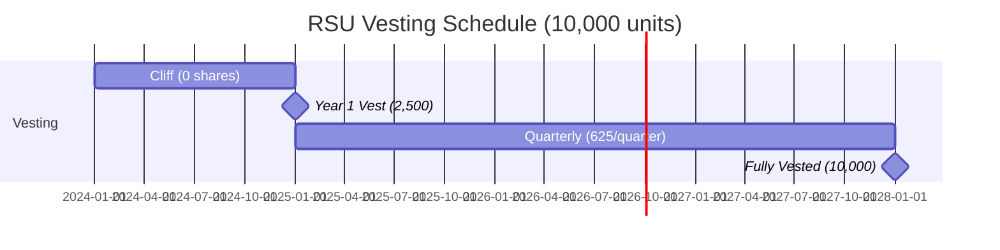

# 💰 HR Compensation Visual Intelligence Demo

This demo showcases Fabric's new **HR Compensation Visual Explainer** - a powerful tool that transforms complex compensation concepts into intuitive visual explanations with memorable analogies.

## 🎯 What It Does

The HR Compensation Visual Explainer takes complex HR compensation topics and generates:

- **Powerful Analogies** that make abstract financial concepts tangible
- **Visual Diagrams** (Mermaid flowcharts, timelines, comparisons)
- **Multi-Level Explanations** (ELI5, Standard, Technical)
- **Real-World Scenarios** with actual numbers
- **Common Q&A** addressing typical questions

## 🚀 Quick Start

### Method 1: Using the Streamlit UI (Recommended)

1. **Install dependencies:**
   ```bash
   pip install -r scripts/python_ui/requirements.txt
   ```

2. **Launch the UI:**
   ```bash
   cd scripts/python_ui
   streamlit run streamlit.py
   ```

3. **Navigate to "💰 HR Compensation Demo"** in the sidebar

4. **Try quick examples** or ask your own questions!

### Method 2: Using the Command Line

```bash
# Basic usage
echo "Explain RSUs with a visual analogy" | fabric --pattern create_hr_compensation_visual

# With specific model
echo "What does 4-year vesting with 1-year cliff mean?" | \
  fabric --pattern create_hr_compensation_visual --model gpt-4

# Save to file
echo "Compare salary vs equity compensation" | \
  fabric --pattern create_hr_compensation_visual -o compensation_guide.md
```

## 📚 Example Scenarios

### 1. Understanding RSUs (Restricted Stock Units)

**Input:**
```
Explain RSUs (Restricted Stock Units) with a visual analogy
```

**What You'll Get:**
- A memorable analogy (e.g., "RSUs are like fruit trees you plant...")
- A Mermaid timeline diagram showing vesting
- ELI5, Standard, and Technical explanations
- Real numbers example
- Common questions answered

### 2. Vesting Schedules

**Input:**
```
Explain 4-year vesting with 1-year cliff using a visual timeline
```

**What You'll Get:**
- Visual timeline showing when shares vest
- Analogy explaining the "cliff" concept
- Month-by-month breakdown
- What happens if you leave early

### 3. Total Compensation Comparison

**Input:**
```
Compare these two offers:
- Offer A: $150K salary + 10,000 RSUs (worth $50/share)
- Offer B: $180K salary only
```

**What You'll Get:**
- Side-by-side comparison diagram
- Present value calculations
- Future value scenarios
- Risk/reward analysis
- Visual breakdown of each component

### 4. Stock Options Explained

**Input:**
```
How do stock options work? What's the difference between ISO and NSO?
```

**What You'll Get:**
- Clear analogy for options (e.g., "like a coupon with an expiration date")
- Comparison chart: ISO vs NSO
- Tax implications visualized
- Exercise scenarios

## 🎨 Visual Formats Supported

The pattern generates multiple visual formats:

### Mermaid Diagrams
- **Flowcharts**: For decision trees (e.g., "Should I exercise my options?")
- **Timelines**: For vesting schedules
- **Pie Charts**: For total compensation breakdowns
- **Sequence Diagrams**: For grant-to-sale processes

### ASCII Art
- Quick conceptual sketches
- Simple comparisons
- Structure visualizations

### Data Tables
- Numerical comparisons
- Year-by-year breakdowns
- Scenario analysis

## 💡 Advanced Usage

### Chaining Patterns

Combine multiple patterns for deeper analysis:

```bash
echo "Equity compensation structure at a Series B startup" | \
  fabric --pattern create_hr_compensation_visual | \
  fabric --pattern summarize
```

### Custom Scenarios

Ask specific questions about your situation:

```
I have 10,000 options at $1 strike price.
The company just valued at $10/share in Series C.
Should I exercise now or wait?
Show me the scenarios visually.
```

### Comparative Analysis

```
Compare these three compensation structures:
1. Big Tech: $200K + $100K/year RSUs
2. Series B Startup: $150K + 0.15% equity
3. Pre-seed: $120K + 0.5% equity

Visualize risk/reward for each over 4 years.
```

## 🎓 Topics You Can Explore

### Equity Structures
- RSUs (Restricted Stock Units)
- Stock Options (ISO vs NSO)
- Stock Grants
- Phantom Stock
- SARs (Stock Appreciation Rights)

### Vesting & Timing
- Standard 4-year vesting
- Cliff periods
- Accelerated vesting
- Refresh grants
- Early exercise

### Valuation & Taxation
- Strike price vs FMV
- 409A valuations
- AMT (Alternative Minimum Tax)
- Capital gains vs ordinary income
- 83(b) elections

### Compensation Strategy
- Total compensation calculation
- Salary bands and ranges
- Performance bonuses
- Benefits valuation
- Negotiation tactics

### Special Scenarios
- What happens when you leave
- Exercise windows
- Company acquisition scenarios
- IPO considerations
- Secondary market sales

## 🔧 Customization

### For HR Teams

Create custom patterns for your organization:

```bash
# Create a company-specific pattern
mkdir -p ~/.config/fabric/patterns/explain_acme_comp

# Add your company's specific details
cat > ~/.config/fabric/patterns/explain_acme_comp/system.md << 'EOF'
# IDENTITY
You are an expert on ACME Corp's compensation structure.

# CONTEXT
ACME offers:
- Base salary in 5 bands
- Annual equity refresh of 0.05%
- 401k with 6% match
- Performance bonus up to 20%

# STEPS
[Use the create_hr_compensation_visual pattern structure]
EOF
```

### For Recruiters

Generate offer comparison sheets:

```bash
echo "Create a visual comparison of our offer vs competitor" | \
  fabric --pattern create_hr_compensation_visual \
  --variable="company=TechCorp" \
  --variable="role=Senior Engineer"
```

## 📊 Sample Output Structure

Here's what a typical output looks like:

```markdown
## 📊 CONCEPT OVERVIEW
[Brief 2-3 sentence summary]

## 🎯 THE ANALOGY
[Memorable real-world comparison]

## 📈 VISUAL REPRESENTATION

### Mermaid Diagram
[Interactive diagram]

### ASCII Visualization
[Text-based diagram]

### Key Numbers
[Important calculations]

## 💡 EXPLANATION LEVELS

### ELI5 Version
[Child-friendly explanation]

### Standard Version
[Professional explanation]

### Technical Version
[Detailed with formulas]

## ⚖️ PROS & CONS
[Balanced analysis]

## 🔍 REAL-WORLD SCENARIO
[Concrete example with numbers]

## ❓ COMMON QUESTIONS
[Q&A section]

## 🎨 ADDITIONAL VISUAL IDEAS
[Other visualization suggestions]
```

## 🎯 Tips for Best Results

1. **Be Specific**: Include numbers, scenarios, or specific questions
2. **Ask for Visuals**: Explicitly request diagrams or timelines
3. **Specify Complexity**: Indicate if you want ELI5 or technical depth
4. **Include Context**: Mention company stage (startup, public, etc.)
5. **Request Comparisons**: Ask to compare multiple scenarios

## 🐛 Troubleshooting

### Mermaid Diagrams Not Rendering?

Install the Streamlit Mermaid component:
```bash
pip install streamlit-mermaid
```

### Pattern Not Found?

Make sure you're in the Fabric directory:
```bash
fabric --updatepatterns
```

### Need a Different Model?

Specify your preferred model:
```bash
fabric --pattern create_hr_compensation_visual --model gpt-4-turbo
```

## 🚀 Next Steps

1. **Try the Quick Start examples** in the Streamlit UI
2. **Experiment with your own scenarios**
3. **Save useful explanations** using the star feature
4. **Share with your team** - export to markdown or PDF
5. **Customize for your organization** - create company-specific patterns

## 💬 Feedback

Have ideas for improving the HR Compensation Visual Explainer?
- Open an issue on GitHub
- Share your use cases
- Contribute example scenarios

---

## 🎨 Example Gallery

### Example 1: RSU Vesting Timeline

**Input:** "Show me a vesting timeline for 10,000 RSUs over 4 years"

**Output Includes:**


### Example 2: Option Value Scenarios

**Input:** "Show option value at different company valuations"

**Output Includes:**
- Scenarios at $5, $10, $20, $50 per share
- Breakeven analysis
- Risk/reward visualization
- Tax implications table

---

**Built with ❤️ using Fabric - Making complex things simple through AI**
