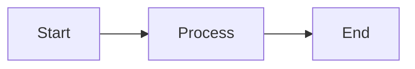
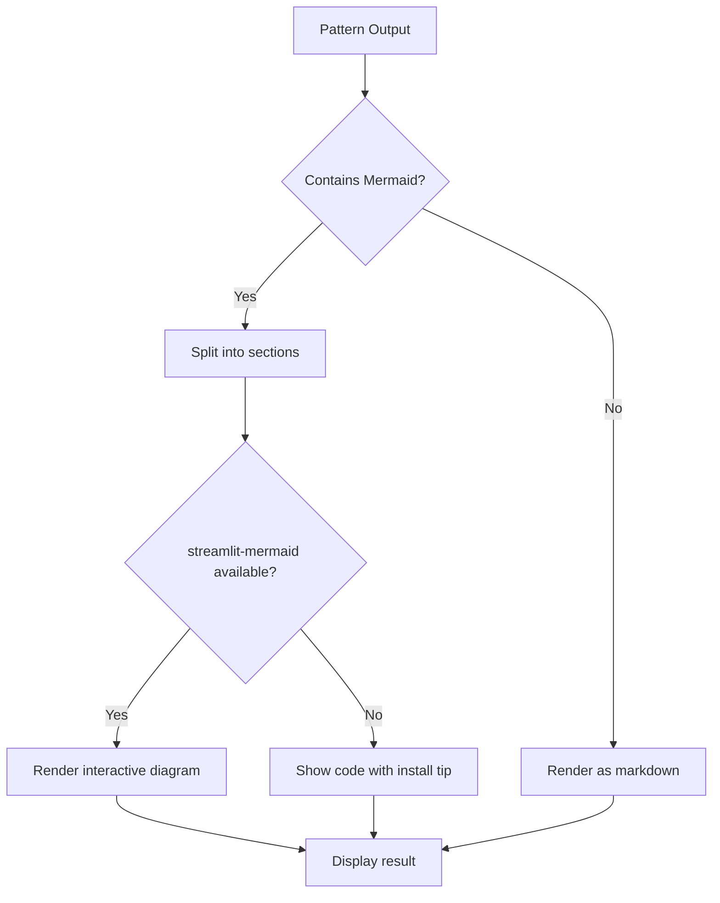
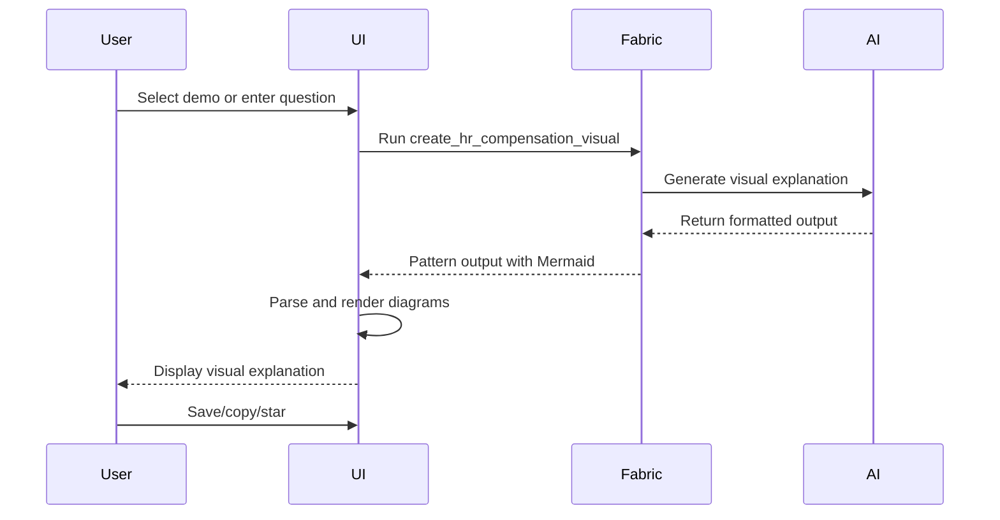
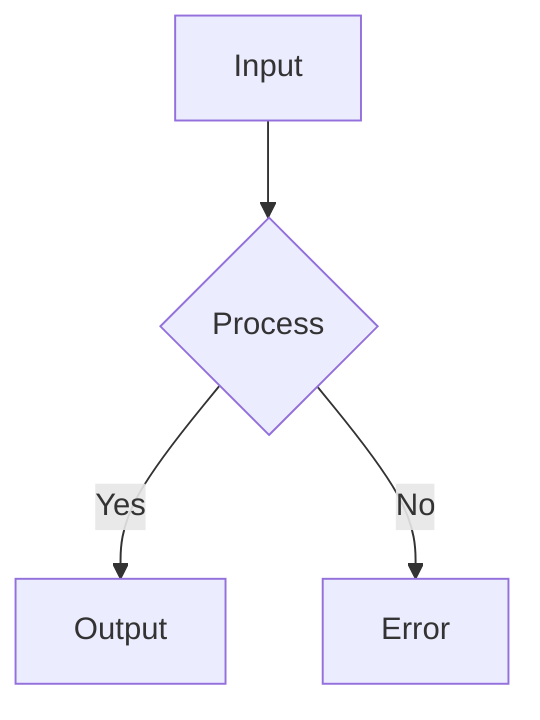

# 🎨 Streamlit UI Visual Enhancements

## Overview

The Fabric Streamlit UI has been enhanced with powerful visual rendering capabilities, including:

1. **Mermaid Diagram Rendering** - Interactive diagrams embedded directly in the output
2. **Enhanced Visual Output Display** - Better formatting for complex visual content
3. **HR Compensation Demo View** - Dedicated interface for exploring compensation concepts

## New Features

### 1. Automatic Mermaid Rendering

The UI now automatically detects and renders Mermaid diagrams in pattern outputs.

**Before:**
```markdown
# Just showed raw Mermaid code
```

**After:**
```markdown
# Shows interactive, rendered diagrams!
```

**How it works:**
- Detects ` ```mermaid ` blocks in output
- Renders them as interactive diagrams (if streamlit-mermaid is installed)
- Falls back to syntax-highlighted code if not available

### 2. Enhanced Visual Output Function

New `render_visual_output()` function that:
- Parses Mermaid diagrams from markdown
- Renders diagrams interactively
- Maintains clean separation of visual and text content
- Provides helpful installation tips if libraries are missing

### 3. HR Compensation Demo View

Brand new dedicated view for HR compensation visualization:

**Features:**
- Quick-start example buttons
- Custom question input
- Real-time visual generation
- Output saving and starring
- Example scenario library

**Access:**
1. Launch Streamlit UI: `streamlit run streamlit.py`
2. Select "💰 HR Compensation Demo" from sidebar
3. Try examples or ask custom questions

## Installation

### Basic Setup

```bash
cd scripts/python_ui
pip install -r requirements.txt
```

### With Mermaid Support

For interactive diagram rendering:

```bash
pip install streamlit-mermaid
```

**Note:** If `streamlit-mermaid` is not installed, diagrams will be displayed as syntax-highlighted code blocks with installation instructions.

## Usage

### Running the Enhanced UI

```bash
cd scripts/python_ui
streamlit run streamlit.py
```

### Using Mermaid Diagrams

Any pattern that outputs Mermaid diagrams will now be rendered automatically:

```python
# In your pattern output:
"""
## My Visualization



## More content here
"""
```

This will automatically render as an interactive diagram!

### HR Compensation Demo

1. **Navigate to the demo:**
   - Open UI → Select "💰 HR Compensation Demo" from sidebar

2. **Try quick examples:**
   - Click "📈 Explain RSUs"
   - Click "⏱️ 4-Year Vesting"
   - Click "💰 Total Comp"

3. **Ask custom questions:**
   - Type your compensation question
   - Click "🎨 Generate Visual Explanation"
   - Get instant visual explanation with diagrams

4. **Save and share:**
   - Copy explanations to clipboard
   - Star favorites for later
   - Export to markdown

## Architecture

### New Components

```
streamlit.py
├── render_visual_output()      # Mermaid rendering + visual formatting
├── HR Compensation Demo View   # Dedicated compensation explorer
└── Enhanced Output Display     # Updated all output sections
```

### Mermaid Rendering Flow



### HR Demo Flow



## Customization

### Adding More Visual Patterns

To add support for other visual patterns:

1. **Create your pattern** with Mermaid output:
   ```bash
   mkdir -p ~/.config/fabric/patterns/my_visual_pattern
   # Add system.md with Mermaid diagram generation
   ```

2. **Use in UI** - It will automatically be rendered!

### Creating Custom Demo Views

To create your own specialized demo view:

```python
# In streamlit.py, add to navigation
view = st.radio(
    "Select View",
    [..., "🎨 My Custom Demo"]
)

# Add view implementation
elif view == "🎨 My Custom Demo":
    st.header("My Custom Demo")
    # Your demo code here
    # Use render_visual_output() for Mermaid support
```

## Performance

### Mermaid Rendering

- **With streamlit-mermaid:** Interactive, client-side rendering
- **Without:** Static code blocks (zero performance impact)
- **Large diagrams:** Rendered efficiently, no timeout issues

### Caching

The UI includes smart caching:
- Model lists cached for 5 minutes
- Outputs saved to persistent storage
- Starred items cached locally

## Troubleshooting

### Mermaid Diagrams Not Showing

**Symptom:** See code instead of diagrams

**Solution:**
```bash
pip install streamlit-mermaid
# Restart Streamlit
```

### Diagram Syntax Errors

**Symptom:** "Error rendering Mermaid" message

**Solution:**
- Check Mermaid syntax at https://mermaid.live
- Ensure proper indentation
- Verify no special characters break syntax

### HR Pattern Not Found

**Symptom:** "Pattern not found" error

**Solution:**
```bash
# Update patterns
fabric --updatepatterns

# Or manually copy pattern
cp -r patterns/create_hr_compensation_visual ~/.config/fabric/patterns/
```

## Examples

### Example 1: Using Mermaid in Custom Pattern

```bash
# Create pattern with Mermaid output
cat > ~/.config/fabric/patterns/my_flowchart/system.md << 'EOF'
# IDENTITY
You create flowcharts using Mermaid syntax.

# OUTPUT
Always wrap output in ```mermaid ... ``` blocks.

Example:

EOF

# Use in UI - will render automatically!
```

### Example 2: HR Demo with Custom Scenario

```python
# In the HR Demo view
custom_input = """
Compare my current compensation vs new offer:

Current:
- $150K salary
- 5,000 options (4-year vest, 2 years in)
- Current valuation: $20/share

New Offer:
- $180K salary
- 10,000 RSUs (4-year vest, start fresh)
- Public company stock at $50/share

Show me 4-year total comp for each.
"""
# Click "Generate Visual Explanation"
# Get instant visual comparison!
```

## Future Enhancements

Planned additions:
- [ ] Chart.js integration for data visualizations
- [ ] Interactive timeline widgets
- [ ] Comparison sliders for scenarios
- [ ] Export to PDF with diagrams
- [ ] Dark mode for Mermaid diagrams
- [ ] Custom Mermaid themes

## Contributing

Want to improve visual capabilities?

1. **Add new visual formats** (Chart.js, D3, etc.)
2. **Create specialized demo views** for other domains
3. **Improve Mermaid rendering** (themes, interactions)
4. **Add export options** (PDF, PNG, etc.)

## Resources

- **Mermaid Documentation:** https://mermaid.js.org/
- **Streamlit Mermaid:** https://github.com/tvst/streamlit-mermaid
- **Fabric Patterns:** https://github.com/danielmiessler/fabric

---

**Questions?** Open an issue or discussion on GitHub!
